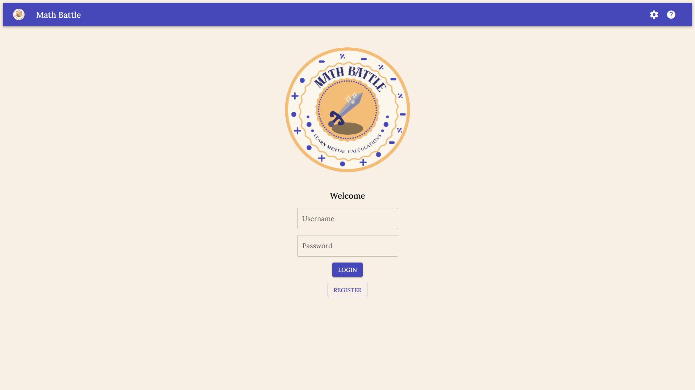

This project was created for the "Advanced Web Technologies" lecture. Users of this application can train mental calculation in a playful and intuitive way. The goal of this web-based game is to defeat the Math Monsters in each level by providing fast and correct answers to progress further.

## Features
- 
By selecting one hero out of four, you can change the game mode. This allows you to train your addition, subtraction, multiplication, or division skills.

- 
To defeat the monsters, you must solve equations within a set time limit to deal damage.

- 
The time you take to solve the equation correlates with the amount of damage you deal.

- 
As you progress further, the difficulty increases.

- 
Each level can be played with all heroes, and you can earn medals with each hero in every level.

- 
You can check your performance on a global leaderboard where the top three users with the highest scores appear.

- 
If you get tired of typing the answers, this application features a multiple-choice setting that you can activate.

## Technologies used

We have decided to use the MERN stack with TypeScript for this project.
- **Frontend**: React / Vite / MUI
- **Backend**: NodeJS / ExpressJS
- **Database**: CosmosDB with Mongoose
- **Deployment**: Azure / Docker

## Technical Architecture

The application includes multiple endpoints for users and levels, as well as several schemas to structure data.

### Users
- **POST /users/login**: Log in the user.
- **POST /users/register**: Register a new user.
- **POST /users/options**: Update the user's options.
- **GET /users/register**: Retrieve the user's options.

### Levels
- **GET /levels**: Retrieve all levels for the user.
- **GET /levels/{id}**: Retrieve a specific level by ID.
- **GET /levels/{id}/battle**: Retrieve all necessary information for a level's battle.
- **GET /levels/{id}/highscores**: Retrieve the top three high scores for a level.
- **POST /levels/{id}/success**: Report the successful completion of a level.

### Schemas
- **LevelSuccessInfo**: Structure for reporting level completion success.
- **User**: Schema for user information.
- **Options**: Schema for user options and preferences.
- **UserResponse**: Structure for user-related responses.
- **SuccessResponse**: Schema for success messages.
- **LevelArray**: Structure for an array of levels.
- **Level**: Schema for level information.
- **LevelBattle**: Structure for level battle details.
- **LevelHighscores**: Schema for high scores of levels.

## How to install

To install and run this application on you computer you have to clone this GitHub repository.
After this you need to install this application.
-   Type `yarn install` in `.../mathbattle`

After you installed all packages you then have to start the application with:
-   Type `yarn run dev` in `.../client`
-   Type `yarn run dev` in `.../server`

## Screenshots

  
    

  
    

## Contributors

Developed by Leonie Keßler, Thomas Dluhosch, Laura Salas López, and Muthna Jasim.